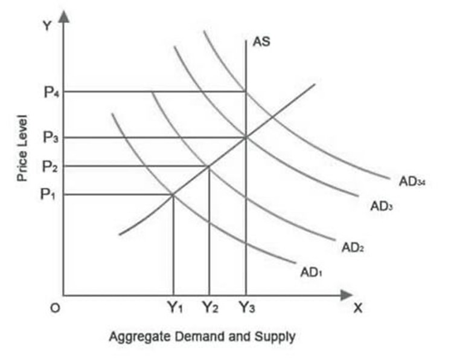
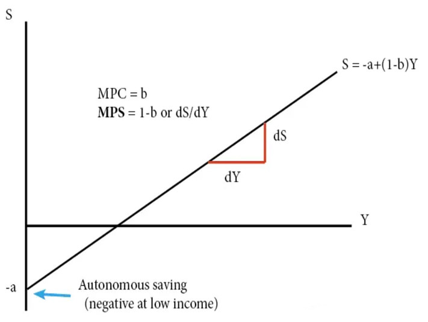

## Introduction

In [1940](https://www.rbi.org.in/commonman/English/History/Scripts/Brief_Chro1935to1949.aspx), India introduced fiat money in the economy. A fiat monetary landscape revolutionised the concept of public spending. The economy is now fuelled by a tripartite combination of [money creation, tax collection and borrowing arrangements](https://eprints.whiterose.ac.uk/153627/10/modern_monetary_theory_and_the_changing_role_of_tax_in_society.pdf). In light of the change in conventional monetary structure, wherein the government is no longer dependent on taxes to finance the expenditure on public goods, it is interesting to study why tax evasion is being punished with [criminal sanctions](https://www.indiacode.nic.in/show-data?actid=AC_CEN_2_2_00039_196143_1524045010860&sectionId=45227&sectionno=276C&orderno=800) under the [The Income Tax Act, 1961](https://www.indiacode.nic.in/bitstream/123456789/2435/1/a1961-43.pdf) (“the Act”). In this piece, the author studies the nature of harm, if any, caused by evasion of tax to suggest a sanctioning structure wherein penalties are proportionate to the damage caused by tax evasion.

## Reevaluating the Harm Caused by Tax Evasion

Today, the government [finances the public expenditure](http://www.paecon.net/PAEReview/issue89/Murphy89.pdf) (G) by a net tax collection (T), government borrowing (B) and money creation (M). It can be summarised as:

G = ∆M +∆B+ T …..(1)

Hence, unlike commodity or commodity-based currency era, the government is not solely dependent on taxes for spending on public goods. However, this does not imply that collection of tax is a futile exercise. Tax evasion still hurts the economy, albeit in unconventional ways.

## Distorts Economic Planning

When a sovereign state, like India, borrows in its own currency, then it is impossible for it to suffer from [debt/financial constraints](https://papers.ssrn.com/sol3/papers.cfm?abstract_id=3990487)[.](https://papers.ssrn.com/sol3/papers.cfm?abstract_id=3990487) It instead faces inflation constraints, which is managed by employing [several tools](https://www.ft.com/content/539618f8-b88c-3125-8031-cf46ca197c64).

As indicated in (1), T forms an essential component of G. However, T is the deducted amount, which is obtained after accounting for gaps \[tax policy gap (Tp) and compliance gap (Tc)\] in gross tax yield (Tt).

T=Tt-Tp-Tc …..(2)

For the sake of this section, the author is concerned with Tc, which consists of evaded tax (Te) and unpaid tax (Tu).

Tc = Te + Tu ….(3)

Tu is a recognised debt and therefore, accounted for in state’s accounts. However, [T](http://www.paecon.net/PAEReview/issue89/Murphy89.pdf)[e](http://www.paecon.net/PAEReview/issue89/Murphy89.pdf) [remains outside the formal economic system](http://www.paecon.net/PAEReview/issue89/Murphy89.pdf) because its existence and extent is unknown to the state.

Modern Monetary Theory (MMT) advocates that tax should not merely be used to withdraw money during an inflationary boom. Instead, varying tax rates [should be included at the planning stage to design a budget](https://www.ft.com/content/539618f8-b88c-3125-8031-cf46ca197c64), which maintains the desired level of inflation. However, owing to the uncertainty surrounding Te, the government is unable to account for tax revenue at the budgeting stage, which reduces the effectiveness of tax as a tool to combat inflation.

Furthermore, evaded tax is the additional money in the economy, which the government did not account for while making spending decisions. This extra cash can [drive up the demand](http://www.ipedr.com/vol4/91-F10116.pdf) over and above the current production capacity of the market, resulting in inflation (refer fig 1).

Lastly, in the event of an inflationary boom due to excess demand, [taxes enable the government to withdraw the money](http://www.paecon.net/PAEReview/issue89/Murphy89.pdf) (cancel the credit originally created through money creation) to restore the market equilibrium by reducing liquidity and offsetting demand. However, illegal evasion of taxes impairs this cancellation function of the state.

## Exacerbates Unequal Distribution

The tax structure is based on the principles of equity. The individuals in the same income bracket pay taxes at the same rate [(horizontal equity)](http://eprints.lse.ac.uk/26074/1/GreeSE_No_31.pdf). The individuals in higher income brackets pay taxes at a higher rate. The principle of progression is adopted to ensure vertical equity in sharing the tax burden (because [with increase in income, its marginal utility decreases](https://commons.lib.niu.edu/bitstream/handle/10843/22650/12-2-373-Stein-pdfA.pdf?sequence=1&isAllowed=y)).

However, with progressivity of taxation, a small percentage of under-reporting, by individuals having higher earning capacities, results in [huge shortfalls in tax receipts](https://papers.ssrn.com/sol3/papers.cfm?abstract_id=3990487). This fall in revenue cannot be met with money creation because s5(1) of [FRBM Act, 2003](https://dea.gov.in/sites/default/files/FRBM%252520Act%2525202003%252520and%252520FRBM%252520Rules%2525202004.pdf)[,](https://dea.gov.in/sites/default/files/FRBM%252520Act%2525202003%252520and%252520FRBM%252520Rules%2525202004.pdf) prohibits monetary financing in normal circumstances. Consequently, the government [resorts to increase in indirect tax rates](http://eprints.lse.ac.uk/26074/1/GreeSE_No_31.pdf), like GST, to compensate for the loss in tax receipts. These regressive taxes exacerbate income inequality in the society.

## Sustains Underperforming Economy

The unreported income does not increase the aggregate demand because [the top 1 percentile](https://www.financialexpress.com/economy/only-1-of-india-pays-income-tax-govt-shows-proof-tax-evasion-still-a-major-roadblock/2088141/), to whom this tax evasion is attributed to, has a [high marginal propensity to save](http://moslereconomics.com/wp-content/uploads/2018/04/Soft-Curency-Economics-paper.pdf) (refer fig 2).

To make matters worse, because huge wealth is owned by a small percentage, a large section of the population lacks resources to create demand. The state aims to resolve this by [redistributing the wealth through imposition of progressive taxes](http://moslereconomics.com/wp-content/uploads/2018/04/Soft-Curency-Economics-paper.pdf). However tax evasion fails the distributive function of taxes and forces the economy to underperform at a low aggregate demand.

## Restricts Local Government’s Public Spending

The union has a special arrangement with the central bank, wherein the government’s expenditure is not limited to the tax revenue or borrowings \[refer (1)\]. However, as things stand, the [state governments do have such a relationship](https://m.rbi.org.in/scripts/PublicationsView.aspx?id=20995) with the RBI and therefore, they act like households who run on earnings (tax revenue) or borrowings.

The income tax collected by the central government is [transferred to the states](https://www.indiabudget.gov.in/doc/rec/annex4.pd) as part of fiscal financial devolution under Article 270 of the [Indian Constitution](https://legislative.gov.in/sites/default/files/COI_English.pdf). Tax evasion reduces the resource pool and therefore, [either decreases the states’ funds to expend on public goods or increases its share of borrowings](https://m.rbi.org.in/scripts/PublicationsView.aspx?id=20995).

## Framing Optimal Punishment Strategy

In the previous section, it was highlighted that Te negatively affects the economy in several ways. Therefore, it should necessarily be curbed. The Act provides for a combination of rigorous imprisonment and fine to deter wilful offenders from attempting [(s276C)](https://www.indiacode.nic.in/show-data?actid=AC_CEN_2_2_00039_196143_1524045010860&sectionId=45227&sectionno=276C&orderno=800) or abetting [(s277A)](https://www.indiacode.nic.in/show-data?actid=AC_CEN_2_2_00039_196143_1524045010860&sectionId=45234&sectionno=277A&orderno=807) tax evasion. It is immaterial whether the any tax was in fact evaded. This blurs the difference between choate and inchoate offences.

In light of the revised nature of harm caused by wilful tax evasion, it becomes interesting to reevaluate the optimality of the age-old sanctions provided under the Act.

S276C or S277A aim to deter evasion of income tax or related payments. [Gary Becker](https://link.springer.com/chapter/10.1007/978-1-349-62853-7_2) has highlighted that to ensure effective deterrence either the probability of detection or the severity of sanctions should be high.

Owing to the self-assessment procedure adopted for filing returns in India, the [detection rate for tax offences is very low](https://dor.gov.in/sites/default/files/FinalBlackMoney.pdf). Therefore, the sanctioning framework, consisting of imprisonment and [reverse burden of proof](https://www.indiacode.nic.in/show-data?actid=AC_CEN_2_2_00039_196143_1524045010860&sectionId=45242&sectionno=278E&orderno=815) (with beyond reasonable doubt standard), is kept stringent for ensuring effective deterrence. However, one might say that instead of placing a disproportionate burden on the taxpayer, the state should develop efficient enforcement structures to increase the detection rate. The author agrees with the proposition and is also aware of the [merits](https://www.jstor.org/stable/10.1086/670398%23metadata_info_tab_contents) of certainty of apprehension over severity of punishment as a mechanism for deterring tax offenses. However, the desired changes will require an overhaul of existing structures, which is a time consuming process. Therefore, this section seeks to provide for a sanctioning framework, which will ensure deterrence in the present system where detection rates are low.

For the sake of simplicity, the rational evader is assumed to be risk neutral. He will evade the tax when his gains (G) are greater than the probability of getting caught (P) and per unit disutility experienced for fine (F) or imprisonment (I) or both.

G \> P (F+I) …..(4)

As already noticed, sanctions (fine or imprisonment) need to be very high because the rate of detection (P) is very low. The author argues these high sanctions should be fines and not rigorous imprisonment, as provided in the Act, for the following reasons.

*First,* it is a well cemented [principle](https://philpapers.org/rec/DUUDOD) that sanctions should be proportionate to the harm caused. Tax evasion, unlike penal offences, does not cause any direct harm. Therefore, a monetary penalty is more suitable.

*Second,* the Indian state machinery is neither efficient nor accurate. This [increases the frequency](https://www.aeaweb.org/articles?id=10.1257%2Fjel.38.1.45) of Type 1 (an offender is not found liable) and Type 2 (an innocent is found liable) errors. Due to the reverse burden of proof, the chances of Type 2 errors increase exorbitantly. Therefore, it is desirable to eliminate imprisonment, which can deprive an innocent of its basic fundamental rights, as a sanction.

*Third*, [imprisonment is costlier than monetary penalties](https://www.aeaweb.org/articles?id=10.1257%2Fjel.38.1.45) because additional cost is incurred for maintenance of prisons whereas fines are mere transfers of money. Hence, employing fines over imprisonment enables enforcement agencies to ensure social welfare maximisation.

*Fourth,* imprisonment is suitable when [physical incapacitation is the goal](https://www.sentencingcouncil.vic.gov.au/sites/default/files/2019-08/How_Much_Does_Imprisonment_Protect_the_Community_Through_Incapacitation.pdf). However, in case of tax evasion, it is illogical to aim for incapacitation through imprisonment because commission of this offence does not require physical presence of the offender. Therefore, when deterrence is the goal, it can be achieved by a less expensive sanction i.e. fines.

## Conclusion

Reviewing S276C and S277A from the lens of MMT revolutionised the understanding of harm caused by a tax evader. It was noticed that the damage is primarily indirect and monetary, which can be alleviated with [alteration of legal structures](https://law.rutgers.edu/sites/law/files/Green.TaxEvasion.pdf). Hence, resorting to imprisonment as a tool to deter tax evasion is considered impractical, disproportionate, unfair and economically dubious.
